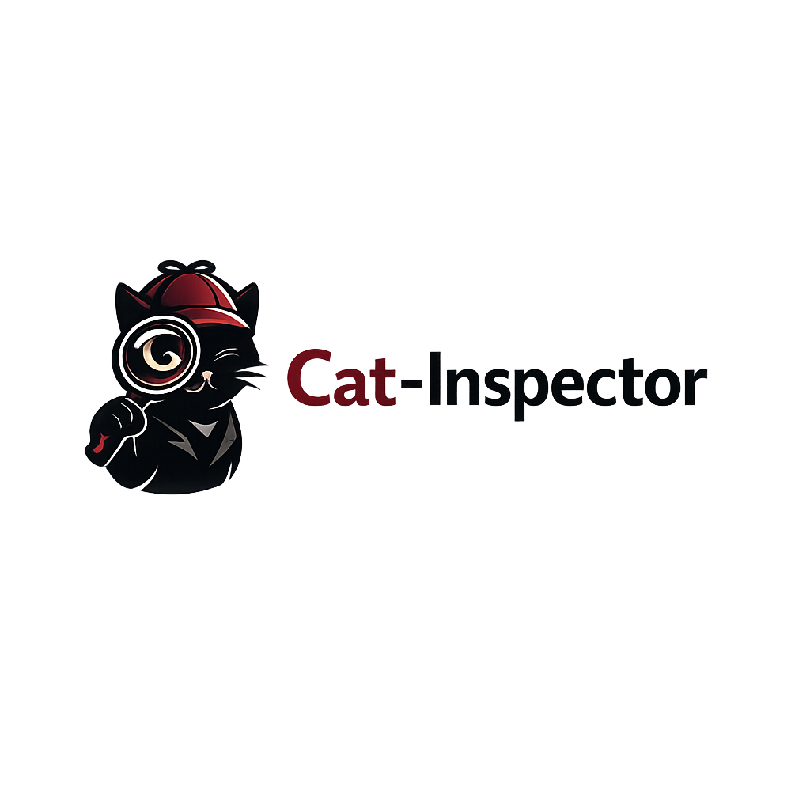

# 🐱 Cat Inspector SDK




 **Welcome!** This is the official home of the TypeScript SDK that connects your backend to QA and inspection tooling—safely, deliberately, and without handing the internet a remote-code-execution button. ✨

The published package is `**@gloocan/cat-inspector`**. All source you can build and ship lives under `**[ts/](./ts/)`**.

---

## 👋 New here? Start calm

**Cat Inspector** is a **host-side library**: you drop it into **your** Node.js app. It does **not** replace your product, your API design, or your database.

Think of it as a friendly gatekeeper:

- 🎯 You choose **which** functions may be discovered and invoked by QA tools.
- 📋 You attach **metadata** (names, parameters, return hints, optional JSON Schema) so generic UIs can build forms and checks.
- 🔒 Only what you **register** is on the menu—nothing else gets exposed by accident.

**You do not need the whole map on day one.** Most teams start with three ideas:

1. **Registration** — how functions join the catalog
2. **Express** — how those units line up with your HTTP world
3. **One transport** — how a QA client says hello (WebSocket, Socket.IO, bridge—pick what you use)

Everything beyond that is **bonus depth** when you need it. 🌱

---

## 🗂️ How `sdk/` fits this repo

This monorepo is bigger than the SDK (think **frontend**, **backend**, deploy recipes, examples). The `**sdk/`** folder is the **canonical home** for Cat Inspector:


| Path                                        | What you’ll find                                                                                      |
| ------------------------------------------- | ----------------------------------------------------------------------------------------------------- |
| 📄 `[README.md](./README.md)` *(this file)* | Friendly orientation—perfect first stop for humans.                                                   |
| 📦 `[ts/](./ts/)`                           | The real **npm package**: `package.json`, `src/`, tests, `PROTOCOL.md`, and `[ts/docs/](./ts/docs/)`. |
| 🧠 `[ts/src/](./ts/src/)`                   | Implementation; the **public API** is whatever `[ts/src/index.ts](./ts/src/index.ts)` exports.        |
| 🏗️ `[ts/dist/](./ts/dist/)`                | Build output from `npm run build` (publishable; often git-ignored).                                   |


> 💡 **Consuming from npm?** You only need the package name + docs—you don’t have to clone the whole repo unless you want examples or contributions.

---

## 🎪 What it *is*

Backend devs **register** hand-picked functions (handlers, services, little modules) as **named, typed, inspectable units**. QA clients get a **catalog**—stable ids, parameters, return metadata, optional tags—and can drive **forms + assertions** instead of shipping bespoke test code for every app.

---

## 🚀 What it’s *for*


| Goal                                 | Why it feels good                                                                                               |
| ------------------------------------ | --------------------------------------------------------------------------------------------------------------- |
| 🛡️ **Controlled surface**           | Pick entry points that are safe and meaningful to call from tooling—not “whatever was imported.”                |
| 🤖 **Machine-friendly descriptions** | Schemas, labels, type hints keep QA UIs generic across products.                                                |
| 🔌 **Authorized clients**            | Embedded WebSocket, optional Socket.IO, remote bridge—listing and invoke stay under **your** process and rules. |


**Typical host:** a **Node.js / Express** (or similar) service where your real business logic already lives. ☕

---

## 🧩 Main areas at a glance


| Area                        | Role                                                                                                     |
| --------------------------- | -------------------------------------------------------------------------------------------------------- |
| 🏷️ **Registration**        | `@Cat`, `cat`, `catModule`, class/service helpers, instance registration → catalog entries.              |
| 📡 **Bootstrap & metadata** | Load/merge catalog + bootstrap data; optional storage-backed bits so tools see one coherent picture.     |
| 🚂 **Express**              | Pipelines, correlation, optional HTTP bridge—meet your routes where they already are.                    |
| ⚡ **RPC surface**           | Invoke by id with structured results/errors—no ad-hoc “run anything” scripting.                          |
| 🌐 **Transports**           | WebSocket server, remote bridge, Socket.IO subpath export when you need it.                              |
| ✅ **Validation & policy**   | JSON Schema, serialization limits, pre-invoke hooks, rate limits, audits.                                |
| 🎨 **Returns & labels**     | `Return`, `Throw`, `ApiReturn` so tooling can tell labeled outcomes apart from plain values.             |
| 🎁 **Optional extras**      | Coverage helpers, OpenAPI export, uploads materialization, jobs/broadcasts, sessions—grab what you need. |


---

## 📖 Tiny glossary


| Term                      | In plain English                                                                             |
| ------------------------- | -------------------------------------------------------------------------------------------- |
| **Host**                  | Your Node process running the SDK and your app code.                                         |
| **Catalog**               | The allowlisted set of registered units + metadata tools may see.                            |
| **Function id**           | Stable string clients use when they invoke something specific.                               |
| **Inspector / QA client** | Another app or UI that talks to your host—not shipped inside this package.                   |
| **Protocol**              | Versioned JSON + message families—see `[ts/PROTOCOL.md](./ts/PROTOCOL.md)` for the contract. |


---

## ✅ Before you integrate (checklist vibes)

- **Node.js** + **npm** (or pnpm/yarn—your house, your rules).  
- **TypeScript** in the host is typical; types ship with the package.  
- **Peers:** `express` when you use Express helpers; `**minio`** / `**socket.io`** are optional—peek at `[ts/package.json](./ts/package.json)`.  
- `**@Cat` decorators?** Turn on `**reflect-metadata`** + TS `**experimentalDecorators`** / `**emitDecoratorMetadata`** (details live in the docs linked below).

---

## 🗺️ Suggested reading order (snackable path)

1. **This README** — you’re almost done with step one. Nice. 🎉
2. `**[ts/docs/protocol-client.md](./ts/docs/protocol-client.md)`** — if you’ll build or wire a client.
3. `**[ts/docs/boostrap.md](./ts/docs/boostrap.md)`** — bootstrap-oriented notes (path matches the repository filename).
4. `**[ts/PROTOCOL.md](./ts/PROTOCOL.md)`** — wire truth; keep clients aligned with `**PROTOCOL_VERSION**`.
5. **[Nextra docs](../qa-test-doc/src/)** — long-form MDX. Run:
  ```bash
   cd qa-test-doc/src && npm install && npm run dev
  ```
   …then open **[http://localhost:3015](http://localhost:3015)** (default dev port).
6. **Runnable demo:** `[examples/cat-demo/backend](../examples/cat-demo/backend/README.md)` — Express + Socket.IO, real bootstrap, copy-paste energy. 🐾

---

## 📚 Doc map (who reads what)


| Resource                               | Best for                           |
| -------------------------------------- | ---------------------------------- |
| `[ts/PROTOCOL.md](./ts/PROTOCOL.md)`   | Wire compatibility detectives 🕵️  |
| `[ts/docs/](./ts/docs/)`               | Day-to-day integrators             |
| `[qa-test-doc/](../qa-test-doc/)`      | Deep dives + searchable reference  |
| `[ts/package.json](./ts/package.json)` | Scripts, `exports`, peers, version |


---

## 🛠️ Install & build (from a full clone)

```bash
cd sdk/ts
npm install
npm run build
npm test
```

**Consumers** add `**@gloocan/cat-inspector`** from your registry or workspace. Imports follow `**package.json` → `exports`** (main entry + optional `**@gloocan/cat-inspector/socket-io`** when published).

---

## 🤝 Contributing

- Keep `**index.ts` exports** stable or clearly versioned—downstream clients will thank you. 🙏  
- Under `sdk/ts`, run `**npm run typecheck`** and `**npm test`** before opening a PR.  
- If behavior crosses the wire, update `**PROTOCOL.md`** plus `**ts/docs/**` or `**qa-test-doc/**` in the same breath when you can.

---

## 🌟 One-sentence summary

**Cat Inspector** is the **host-side SDK** that says *which* backend behavior is QA-visible, *how* tools should describe and validate it, and *how* authorized clients connect—while keeping the whole story explicit in **your** codebase.

---

*Happy inspecting! 🐱✨*
