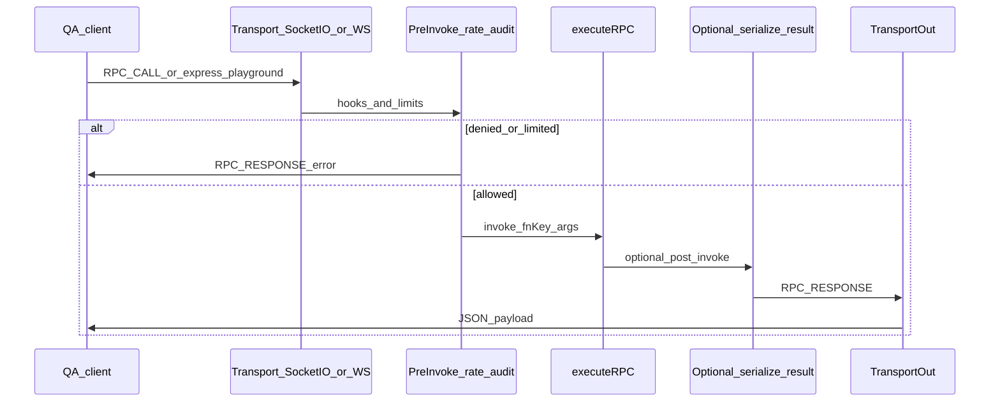
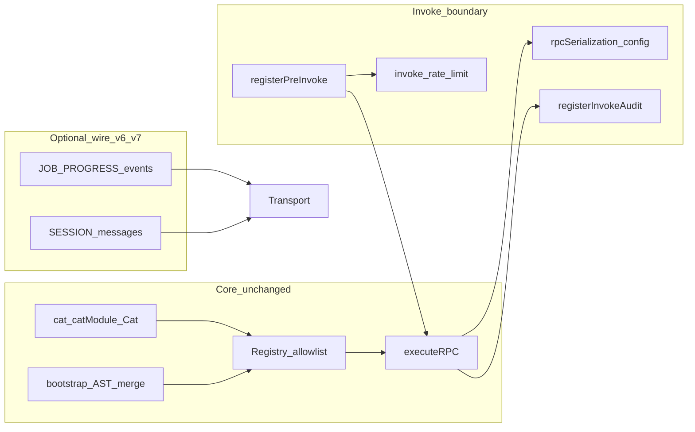

# QA SDK extension architecture

This guide explains how the **catalog → invoke → (optional) serialize → transport** pipeline fits together, how roadmap gaps are closed **additively**, and where to plug in wrappers vs SDK hooks vs new wire messages.

It complements [qa-sdk-limitations-and-wrappers.md](qa-sdk-limitations-and-wrappers.md) and [qa-sdk-wrappers-hard-cases.md](qa-sdk-wrappers-hard-cases.md).

## End-to-end flow

## Component map

## Gap matrix

| Gap | Typical pattern today | SDK / transport enhancement | Phase |
|-----|------------------------|------------------------------|-------|
| Express `req`/`res` vs RPC | Thin QA wrapper `cat(fnKey, dto => …)` | Optional `invokeExpressSynthetic` (local HTTP roundtrip) | P5 |
| **Pattern B** — catalogued `fnKey` hits real Express stack | Same wrapper or skip catalog | `registerHttpBridgeRoute(app, { fnKey, method, path, mapArgsToBody })` → `executeRPC` uses `invokeExpressSynthetic` under `invokeKind: 'http_synthetic'`; still allowlisted; **host-only** registration (not in JSON catalog snapshot) | P5b |
| Large binary / streams | `__qaFileRef` + in-memory upload store | `bootstrap.storage` adapter + `artifactThresholdBytes` + fail-fast `QA_STORAGE_NOT_CONFIGURED` | P3 |
| Non-JSON-safe `result` | Manual DTOs | Opt-in `rpcSerialization` on `bootstrap` / `attachCatRPC` / `startInspectorWebSocket` | P1 |
| Security / policy | Env checks in handlers | `registerPreInvoke`, optional rate limit, `registerInvokeAudit` | P2 |
| Long work | Blocking RPC | Job registry helper + `JOB_PROGRESS` broadcasts; session helpers | P4 |
| TS ergonomics | Single object arg | Docs + future codegen | Docs |
| Non-Node clients | N/A | [protocol-client.md](protocol-client.md) + sample client | P6 |

## Configuration surfaces

| Option | Where | Effect |
|--------|-------|--------|
| `rpcSerialization` | `BootstrapOptions`, `InspectorWebSocketOptions`, `attachCatRPC({ bootstrap })` | When `enabled: true`, `executeRPC` normalizes `result` for JSON (BigInt, Date, plain objects only, size cap). |
| `storage`, `artifactThresholdBytes` | `BootstrapOptions` | Validates large-artifact policy; host supplies `storage.adapter` for presign wiring (secrets stay in env). |
| `registerPreInvoke` | Module `invoke-policy.ts` | Deny or rewrite before handler runs (Socket.IO + WebSocket transports). |
| `invokeRateLimit` | `attachCatRPC`, `InspectorWebSocketOptions` | Token bucket per socket / per WS connection. |
| `registerInvokeAudit` | Module `invoke-policy.ts` | Observe each invoke outcome. |
| `invokeTimeoutMs` | `BootstrapOptions`, `InspectorWebSocketOptions`, Socket.IO attach options | Optional cap on handler / HTTP-bridge `await` duration (`INVOKE_TIMEOUT`). |
| `registerHttpBridgeRoute` | Host startup (needs `Express` `app`) | Maps a registered `fnKey` to synthetic in-process HTTP (`invokeKind: 'http_synthetic'`). |
| `exportRegistryOpenApi` | Tooling / docs | OpenAPI 3.1 snapshot from registry (`openapi/registry-to-openapi.ts`). |

Defaults preserve historical behavior: serialization off, no storage threshold unless set, hooks no-op unless registered.

## See also

- [qa-sdk-artifact-job-patterns.md](qa-sdk-artifact-job-patterns.md)
- [protocol-client.md](protocol-client.md)
- [openapi-registry-export.md](openapi-registry-export.md)
