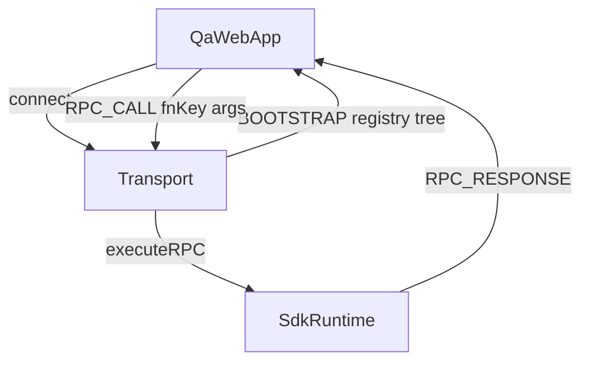
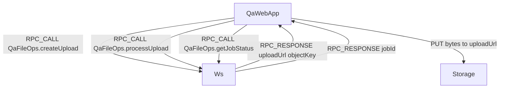
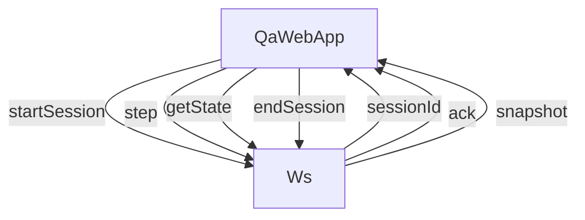

# QA SDK: limitations and wrapper-based solution

This document summarizes how the `@gloocan/cat-inspector` SDK works for no-code QA, which situations need extra design, and **how to expose QA-safe wrappers** (use-case functions) instead of raw internals.

**Architecture (gaps, phases, diagrams):** [qa-sdk-extension-architecture.md](qa-sdk-extension-architecture.md). **Artifacts / jobs / sessions:** [qa-sdk-artifact-job-patterns.md](qa-sdk-artifact-job-patterns.md).

## Current system (as-is)

### What you already have

- **Catalog/metadata**: a registry snapshot (`Record<fnKey, RegistryEntry>`) sent to clients on connect (`BOOTSTRAP` over WebSocket, or `catalog:bootstrap` over Socket.IO).
- **Invocation**: `RPC_CALL` with `{ requestId, fnKey, args }` → `RPC_RESPONSE` with `status`, `result`, `returnType`, `returnShape`, `label`, `error`.
- **Allowlist**: only `fnKey`s present in `Registry` can be invoked.
- **Protocol versioning**: `PROTOCOL_VERSION` in `src/types.ts`.

### Wire flow (conceptual)

### Registry metadata (`RegistryEntry`)

- Stable **function identity** via `fnKey` (e.g. `OrdersService.placeOrder`).
- `params`: `{ name, type }[]` (type strings; AST merge can expand object shapes).
- `declaredReturn`, labeled `returns` / `errors` / `apiResponses` when using `Return` / `Throw` / `ApiReturn`.
- Optional `returnJsonSchema` for JSON Schema validation in QA UIs; the host may also enable **server-side** validation (AJV, post-serialize) via `rpcSerialization.validateReturnJsonSchema` (see [qa-sdk-wrappers-hard-cases.md](qa-sdk-wrappers-hard-cases.md) §7).

## Practical limitations (why not every function is a good QA callable)

1. **Context-heavy**: Express `req/res`, raw sockets, streams. QA cannot serialize these; use a **wrapper** with JSON inputs.
2. **Non-serializable I/O**: `Buffer`, `Stream`, ORM instances, circular refs. Enforce **JSON-safe DTOs** at the boundary.
3. **Security / policy**: allowlist alone is not enough; add **env gating**, roles, rate limits for QA invokes.
4. **Side effects**: payments, deletes, emails. Use **sandbox**, **idempotency keys**, **dry-run** where appropriate.
5. **Long-running / realtime**: use **job IDs** (`jobId` + `getJobStatus`) or **session APIs** (`start/step/getState/end`) instead of one-shot RPC for everything.

## Solution overview

### Core idea

Developers expose a **QA wrapper layer**:

- Small set of **QA-safe functions** (use-cases), registered with `cat()` / `catModule()` / `@Cat`.
- **JSON-in / JSON-out** contracts.
- Optional **`registerReturnJsonSchema(fnKey, schema)`** for stable assertions.

The SDK continues to discover and allowlist these functions; **business logic stays internal** (services, repos, middleware).

### Streaming (large files): presigned URL pattern

Bytes do not travel inside JSON RPC. RPC returns **URLs and metadata**; the client uploads/downloads over HTTP to storage.

### File params (Socket.IO upload + invoke-time materialization)

For QA workflows that want **“pick a file in the UI and call `cat()` like normal”**, the Socket.IO transport can support a binary upload channel plus a JSON-safe placeholder in `rpc:call`.

- **Developer experience**
  - Developers write a normal `cat()`/`catModule()`/`@Cat` entry with a `File`, `File[]`, `Buffer`, or nested `File` fields inside an object DTO.
  - They do **not** handle `__qaFileRef` or S3/objectKey lookups inside that handler.

- **Wire behavior**
  - The QA UI uploads bytes via `qa:upload:*` (Socket.IO binary frames).
  - The subsequent `rpc:call` uses placeholders such as `{ "__qaFileRef": "<uploadId>" }` or arrays of refs.
  - The SDK materializes those placeholders into real `File`/`Buffer` values **immediately before invocation** (service args) or attaches them to `req.file`/`req.files` (express).

When you need very large files or cross-system storage, prefer the presigned URL pattern above. When you want “RPC feel” + quick QA iteration on moderate-sized files, use the Socket.IO materialization path.

### Realtime sessions: state machine

## What is new (conceptual) for teams adopting this

### Developers

- Explicit **QA wrapper modules** and naming conventions.
- Conventions: `dryRun?`, `idempotencyKey?`, tenant/sandbox flags where relevant.

### SDK/runtime (future phases)

Stronger invoke-boundary behavior (validation, policy, JSON-safe results) is specified in [qa-sdk-wrappers-hard-cases.md](qa-sdk-wrappers-hard-cases.md) (section 7: today vs target). Optional **WebSocket** push for job/session progress remains a separate enhancement.

## See also

- [qa-sdk-wrappers-hard-cases.md](qa-sdk-wrappers-hard-cases.md) — hard-case contracts, serialization rules, policy model, pattern catalog, failure semantics, coverage matrix
- [PROTOCOL.md](../PROTOCOL.md) — protocol and registry notes
- Example wrappers in `examples/cat-demo/backend/src/qa-wrappers/` (demo app)
