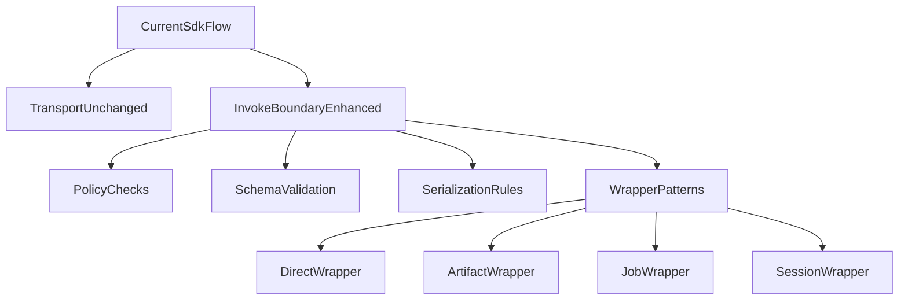
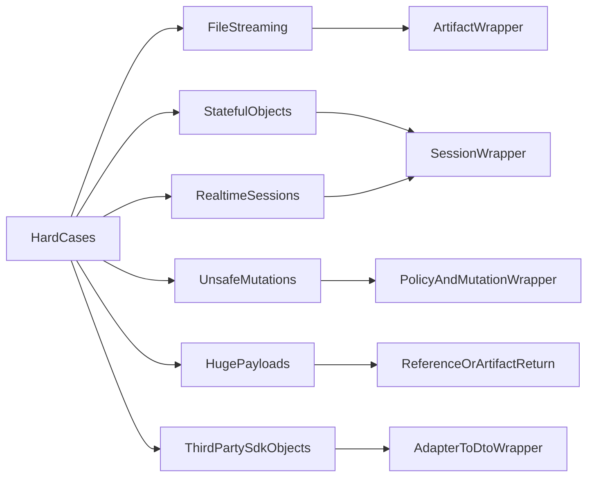

# QA SDK: hard-case coverage and wrapper contracts

This document implements the **hard-case coverage** specification for no-code QA: what stays the same in the wire protocol, what should be **enhanced over time** at the invoke boundary, and what **developers must express** via QA-safe wrappers. It complements [qa-sdk-limitations-and-wrappers.md](qa-sdk-limitations-and-wrappers.md).

**Architecture (gap matrix, sequence diagrams):** [qa-sdk-extension-architecture.md](qa-sdk-extension-architecture.md).

Companion reference: the original design goals align with the wrapper strategy in the limitations doc; this file adds **enforceable contracts**, **serialization rules**, **policy**, **patterns**, **failure semantics**, and a **coverage matrix**.

## 1. Unchanged vs enhanced vs new

### Unchanged (core SDK flow)

These stay as today:

- Registry and **bootstrap** / catalog merge mechanics
- Transport shape: connect → **`BOOTSTRAP`** (registry + tree) → **`RPC_CALL`** → **`RPC_RESPONSE`**
- **Allowlist**: only registered `fnKey`s are invokable
- **`PROTOCOL_VERSION`** in `src/types.ts`

### Enhanced (invoke boundary — target state)

Over time, the runtime should strengthen (not all of this exists yet; see [section 7](#7-sdk-runtime-enforcement-today-vs-target)):

- Input validation (beyond arg count)
- Policy checks (environment, side-effect rules)
- Output serialization safety and size limits
- Optional output validation against `returnJsonSchema`

### New (developer-facing, not a protocol replacement)

- **Wrapper design rules** (this document)
- Standard **patterns**: direct JSON, artifact/file URLs, jobs, sessions, mutation-safe APIs
- **Authoring standards** so no-code tests stay stable and safe

## 2. Non-negotiable QA wrapper contract

QA-callable units (registered with `cat` / `catModule` / `@Cat`) should obey:

| Rule | Detail |
|------|--------|
| JSON in | Arguments must be expressible as a JSON array over the wire (what the QA UI sends). |
| JSON out | Return values must be JSON-serializable for stable RPC responses (DTOs, primitives, plain objects, arrays). |
| No runtime-only parameters | Do not require `req`, `res`, `next`, raw streams, sockets, file handles, or opaque SDK client instances as inputs. |
| No opaque returns | Do not return raw ORM entities, class instances with methods, `Buffer`, Node streams, or circular graphs as the primary result. |
| Prefer references | For large or binary data, return `{ objectKey }`, `{ jobId }`, `{ url }`, `{ sessionId }`, etc., not bulk bytes. |
| Stable for saved cases | Inputs/outputs should be stable enough for saved no-code scenarios (avoid nondeterministic noise in asserted fields). |

## 3. Serialization boundary rules

Normalize or avoid types that do not round-trip through JSON cleanly:

| Situation | Rule |
|-----------|------|
| `Date` | Prefer ISO strings in DTOs. |
| `BigInt` | JSON does not support `BigInt`; use `string` (or `number` if safe). |
| Prisma `Decimal` / similar | Use `string` (or fixed-precision number) in DTOs. |
| Binary / streaming | Do not return raw streams; use **presigned URL** or **artifact id** patterns. |
| Large payloads | Return **references** (ids, keys, URLs); paginate or poll. |
| Circular / non-serializable | Should be rejected at the boundary with a clear error once output serialization is enforced (see section 7). |

**Current risk:** `executeRPC` returns `result` as produced by the handler; strict JSON-safe serialization at the boundary is a **target** improvement.

## 4. Policy model (design-time)

Express policy in wrapper design and (optionally) future registry metadata:

| Concern | Examples |
|---------|----------|
| Environments | Allow QA invokes only in `development` / `staging`, or gated prod. |
| Tenants / roles | Require tenant id or role in input; reject in wrapper if missing. |
| Side effects | Mark destructive flows; require `dryRun` or sandbox ids where needed. |
| Idempotency | Require `idempotencyKey` for writes that must not double-apply. |
| Rate / abuse | Rate-limit at transport or wrapper (future). |
| Timeouts | Long work → job pattern with `getJobStatus`, not unbounded RPC. |

## 5. Standard wrapper pattern catalog

| Pattern | When to use | Typical inputs | Typical outputs | QA UI |
|---------|-------------|----------------|-----------------|-------|
| **Direct** | Simple JSON-safe service calls | Plain object / scalars | DTO / scalars | Form + assertions on `result` |
| **Artifact** | Uploads, downloads, large blobs | `filename`, `contentType`, `sizeBytes` | `uploadUrl`, `objectKey`, `expiresAt` | Steps: RPC → HTTP upload → RPC process |
| **Job** | Imports, reports, async work | `objectKey`, options | `jobId` | Poll `getJobStatus` |
| **Session** | Chat, devices, stateful flows | `userId`, `sessionId`, `event` | `sessionId`, `ack`, state snapshot | Multi-step scenario |
| **Mutation-safe** | Risky prod-like actions | Same as direct + `dryRun?`, `idempotencyKey?` | Same with explicit safe semantics | Assertions + policy flags |

## 6. Failure semantics

Failures should map predictably for the QA UI. Today, [`RpcResponse`](../src/types.ts) carries:

- `status: 'ok' | 'error'`
- `error: RpcErrorDetail | null` with `message`, `stack`, `layer: 'validation' | 'expected' | 'unexpected'`, and optional **`code`** (stable string, e.g. `FN_NOT_FOUND`, `INVOKE_TIMEOUT`)

**Target categories** (map to `layer` and message conventions):

| Failure | Suggested `layer` | Notes |
|---------|-------------------|--------|
| Policy blocked (wrong env, no permission) | `validation` | Clear message, no invoke |
| Invalid input (future schema validation) | `validation` | Before handler runs |
| Invalid output / non-serializable (future) | `validation` | After handler returns |
| Payload too large | `validation` | Request/response limits |
| Expected domain error | `expected` | Handler / `Throw` path |
| Unexpected bug | `unexpected` | Bugs, infrastructure |

## 7. SDK runtime enforcement: today vs target

| Responsibility | Today (`executeRPC`) | Target |
|----------------|----------------------|--------|
| Allowlist by `fnKey` | Yes | Yes |
| Arg count match | Yes | Yes |
| Input JSON schema validation | **Yes (opt-in)** — AJV on the positional `args` array when `rpcSerialization.validateParamsJsonSchema: true` and `RegistryEntry.paramsJsonSchema` is set (`cat` / `catModule` options or `registerParamsJsonSchema`); failures use `error.code` **`INPUT_SCHEMA_INVALID`** | Optional (default off) |
| Policy (env / role) | No | Optional |
| Output JSON-safe serialization | No | **Opt-in** via `bootstrap({ rpcSerialization: { enabled: true, maxUtf8Bytes? } })` / `attachCatRPC({ rpcSerialization })` / `startInspectorWebSocket({ rpcSerialization })` |
| Output size limit | No | **With** `rpcSerialization.enabled` (default cap when unset) |
| `returnJsonSchema` validation on server | **Yes (opt-in)** — AJV after serialize when `rpcSerialization: { enabled: true, validateReturnJsonSchema: true }` and entry has `returnJsonSchema` | Optional (default off) |
| Timeout | **Yes (opt-in)** — `invokeTimeoutMs` on `bootstrap` / `startInspectorWebSocket` / `attachCatRPC` | Optional (default off) |

**`paramsJsonSchema` (whole-args tuple):** Use a single JSON Schema with `type: "array"`, tuple `items` for each positional argument, and `minItems` / `maxItems` matching arity (use `additionalItems: false` when multiple positionals). Catalog `params[].type` strings remain display-only and are not auto-derived into wire validators.

## 8. Unsupported direct exposures

Do **not** expose these as generic QA-callable units:

- Raw Express / Connect handlers (`req`, `res`, `next`)
- Raw streams, sockets, or file descriptors
- In-memory-only objects that cannot be reconstructed from JSON
- ORM model instances or arbitrary class graphs
- Third-party SDK objects (unless wrapped into DTOs)
- Giant binary bodies as RPC `result`

## 9. Developer checklist (before exposing a wrapper)

- [ ] Are all inputs JSON-representable from the QA form?
- [ ] Is the return value JSON-safe and stable for assertions?
- [ ] Does it mutate production data? If yes: sandbox, `dryRun`, or idempotency?
- [ ] Is the operation long-running? If yes: job pattern (`jobId` + status).
- [ ] Is it stateful / realtime? If yes: session pattern (`sessionId`, steps, `getState`).
- [ ] Large files or reports? If yes: artifact / URL / reference pattern.
- [ ] Should `registerReturnJsonSchema` be set for stable QA checks?
- [ ] Should `paramsJsonSchema` (or `registerParamsJsonSchema`) plus `validateParamsJsonSchema` be enabled for stable wire inputs?

## 10. Coverage matrix

| Real-world situation | Supported approach | Not supported as raw RPC |
|----------------------|--------------------|---------------------------|
| Simple service method | Direct wrapper | — |
| Prisma / ORM read/write | DTO wrapper (map in handler) | Returning `User` entity as-is |
| File upload / download | Artifact / presigned URL + optional job | Streaming bytes in `result` |
| Background import / report | Job wrapper | Blocking until completion without job API |
| Chat / device / game session | Session wrapper | Single call that “holds” connection |
| Destructive prod action | Policy + mutation-safe wrapper | Ungated invoke in prod |
| Raw TCP/WebSocket protocol | Adapter + session or out-of-band | Passing socket through args |
| Third-party SDK response | Map to DTO in wrapper | Returning opaque SDK object |

## Expected outcome (strategy)

- Core transport and registry model stay in place.
- Hard cases are handled by **explicit wrapper patterns**, not by invoking arbitrary internals.
- “Works in most situations” means **there is a supported pattern** for typical backend QA needs—not that every registered function is safe to call without design.
- Example implementations: `examples/cat-demo/backend/src/qa-wrappers/` (demo).

## See also

- [qa-sdk-limitations-and-wrappers.md](qa-sdk-limitations-and-wrappers.md) — overview and streaming/session diagrams
- [PROTOCOL.md](../PROTOCOL.md) — wire format and registry
- [types.ts](../src/types.ts) — `RpcResponse`, `RegistryEntry`, `PROTOCOL_VERSION`
